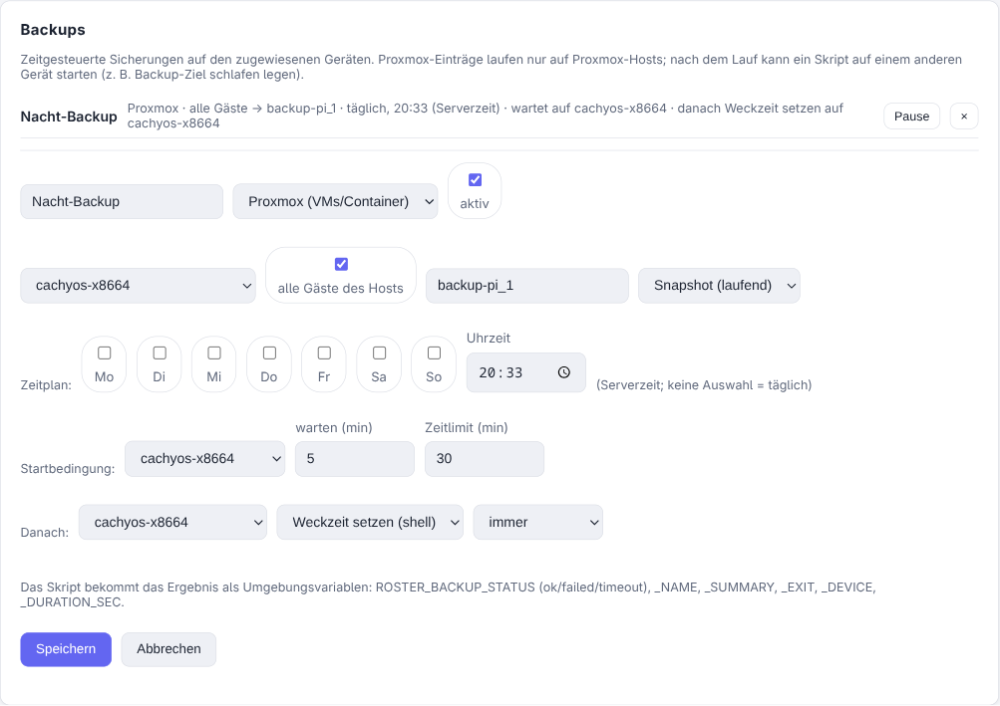

# Backups

Policies have a **Backups** section: scheduled backups that run on the assigned devices,
with a start condition and a follow-up action **on another device**. Each entry has a
**type** — today *Proxmox* (VMs and containers) and *Script* (anything else, e.g. a
Windows PC running `wbadmin` or a vendor CLI).

{ .shadow }

## Why this is not a task

Tasks are scheduled *by the agent*, which only knows itself. Backups are scheduled **by
the server**, which is what makes three things possible:

- a **start condition**: begin only once another device is reachable,
- a **follow-up action on a different device** than the one that ran the backup,
- schedules that survive an agent restart (a task's next-run state lives in agent memory).

Times are **server time**, not the device's.

## An entry

| Field | Meaning |
| ----- | ------- |
| Type | *Proxmox*: guests (all, or picked from the host's inventory), storage, mode. *Script*: a script from the library. |
| Schedule | Weekdays (none = daily) and a time. A run that is missed — server down — is caught up for up to 6 hours, never later. |
| Start condition | Wait until a device is online, up to N minutes; after that the run counts as failed. |
| Time limit | Aborts a run that takes longer. |
| Afterwards | Script + device, run *always*, *only on success* or *only on failure*. |

Proxmox entries only run on devices that report a Proxmox version, so assigning the policy
to a whole site does not start backups on every workstation.

## The follow-up action

The follow-up script runs through the agent on the chosen device and receives the result
as environment variables:

| Variable | Example |
| -------- | ------- |
| `ROSTER_BACKUP_STATUS` | `ok`, `failed`, `timeout` |
| `ROSTER_BACKUP_NAME` / `_ID` / `_RUN_ID` | the entry and this run |
| `ROSTER_BACKUP_EXIT` | exit code |
| `ROSTER_BACKUP_SUMMARY` | e.g. `1 von 5 Gästen fehlgeschlagen – 102: device busy` |
| `ROSTER_BACKUP_DEVICE` | host that ran the backup |
| `ROSTER_BACKUP_STARTED` / `_FINISHED` / `_DURATION_SEC` | timing |

Two details that matter in practice:

- With *always*, the follow-up runs **even when the backup failed or timed out**. A backup
  target that powers itself down after the run must not stay awake because a backup broke.
- If several backups feed the same follow-up device, only the **last** finished run
  triggers it — otherwise the first one would send the target to sleep while another
  backup is still writing.

## Example: wake-on-schedule backup target

A Raspberry Pi holds the NFS share and wakes at 18:00; the Proxmox jobs are disabled in
PVE so they never run while it sleeps.

1. Backup entry, type *Proxmox*, all guests, storage `backup-pi_1`, daily at 18:00.
2. Start condition: wait for the Pi, up to 30 minutes.
3. Afterwards: script *set next wake time* on the Pi, run *always* — it writes
   `/sys/class/rtc/rtc0/wakealarm` and shuts the Pi down.

The Pi needs a Roster agent for this (64-bit OS; the server ships an `arm64` agent).

## Runs

Every run is recorded: status, start, duration, per-guest summary and the tail of the
vzdump log. The device page has a **Backups** tab with the history and a *Run now* button
(needs the *Operate devices* permission). A failed or timed-out run raises an alert
through the configured channels, respecting maintenance windows and minimum severity.

!!! note "Proxmox jobs and the backup check"
    Roster starts `vzdump` with its own selection, so the guests are not part of a PVE
    **job**. The resulting backups are ordinary backups — they appear in Proxmox and count
    for [the `proxmox_backup` check](proxmox.md#backup-check) — but that check's option
    *require backup job* has to be switched off, since Proxmox derives it from job
    definitions.

!!! warning "Reach of the policies permission"
    Anyone who may edit policies can have a script run on **another** device through a
    follow-up action. That is the same power as scripts plus policies today, but it now
    crosses device boundaries.
