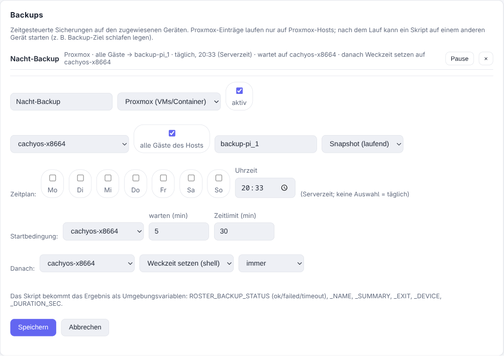

# Backups

Policies have a **Backups** section: scheduled backups that run on the assigned devices,
with a start condition and a follow-up action **on another device**. Each entry has a
**type** — today *Proxmox* (VMs and containers) and *Script* (anything else, e.g. a
Windows PC running `wbadmin` or a vendor CLI).

{ .shadow }

## Why this is not a task

Tasks are scheduled *by the agent*, which only knows itself. Backups are scheduled **by
the server**, which is what makes three things possible:

- a **start condition**: begin only once another device is reachable,
- a **follow-up action on a different device** than the one that ran the backup,
- schedules that survive an agent restart (a task's next-run state lives in agent memory).

Times use the **central time zone** (Settings → General → Time zone). Without one set,
they fall back to the server's own clock — which in a container is usually UTC.

## An entry

| Field | Meaning |
| ----- | ------- |
| Type | *Proxmox*: guests (all, or picked from the host's inventory), storage, mode. *Script*: a script from the library. |
| Target per guest | Each guest can override the default storage, so one entry can write guest 107 to `backup-pi_1` and guest 110 to `backup-pi_2`. The agent then runs one `vzdump` per node **and** target. Needs agent 0.16.0 — with an older one the run fails with a clear message instead of quietly using the default storage. |
| Keep the last N | Retention per guest on the target. After a successful backup `vzdump` prunes older archives of that guest (`--prune-backups keep-last=N`) until N remain. Empty = the storage's own retention in Proxmox applies, and without one there Proxmox keeps **everything** — which is how a backup storage fills up. Needs agent 0.16.2; an older agent fails the run with a clear message instead of silently keeping all. |
| Schedule | Weekdays (none = daily) and a time. A run that is missed — server down — is caught up for up to 6 hours, never later. |
| Start condition | Wait until a device is online, up to N minutes; after that the run counts as failed. |
| Time limit | Aborts a run that takes longer. |
| Afterwards | Script + device, run *always*, *only on success* or *only on failure*. |

Proxmox entries only run on devices that report a Proxmox version, so assigning the policy
to a whole site does not start backups on every workstation.

## The follow-up action

The follow-up script runs through the agent on the chosen device and receives the result
as environment variables:

| Variable | Example |
| -------- | ------- |
| `ROSTER_BACKUP_STATUS` | `ok`, `failed`, `timeout` |
| `ROSTER_BACKUP_NAME` / `_ID` / `_RUN_ID` | the entry and this run |
| `ROSTER_BACKUP_EXIT` | exit code |
| `ROSTER_BACKUP_SUMMARY` | e.g. `1 von 5 Gästen fehlgeschlagen – 102: device busy` |
| `ROSTER_BACKUP_DEVICE` | host that ran the backup |
| `ROSTER_BACKUP_STARTED` / `_FINISHED` / `_DURATION_SEC` | timing |

Two details that matter in practice:

- With *always*, the follow-up runs **even when the backup failed or timed out**. A backup
  target that powers itself down after the run must not stay awake because a backup broke.
- If several backups feed the same follow-up device, only the **last** finished run
  triggers it — otherwise the first one would send the target to sleep while another
  backup is still writing.

## Example: wake-on-schedule backup target

A Raspberry Pi holds the NFS share and wakes at 18:00; the Proxmox jobs are disabled in
PVE so they never run while it sleeps.

1. Backup entry, type *Proxmox*, all guests, storage `backup-pi_1`, daily at 18:00.
2. Start condition: wait for the Pi, up to 30 minutes.
3. Afterwards: script *set next wake time* on the Pi, run *always* — it writes
   `/sys/class/rtc/rtc0/wakealarm` and shuts the Pi down.

The Pi needs a Roster agent for this (64-bit OS; the server ships an `arm64` agent).

Compute the wake time with an explicit zone, not the Pi's system time — a fresh Raspberry
Pi OS often sits on `Europe/London`:

```sh
target=$(TZ=Europe/Berlin date -d "tomorrow 20:00" +%s)
echo 0 > /sys/class/rtc/rtc0/wakealarm
echo "$target" > /sys/class/rtc/rtc0/wakealarm
shutdown -h +1          # delay, so Roster still collects the result
```

Do not halt immediately: the agent reports the script's result at the check-in it triggers
right after the run, and a machine that is already off reports nothing.

## Runs

Every run is recorded: status, start, duration, per-guest summary and the tail of the
vzdump log. The device page has a **Backups** tab with the history and a *Run now* button
(needs the *Operate devices* permission). A failed or timed-out run raises an alert
through the configured channels, respecting maintenance windows and minimum severity.

### Pruning a full storage

`vzdump` prunes **after** it has written the new archive, so the target briefly needs room
for one more backup per guest. If a storage is already full, the next run fails before any
pruning happens. For that case the **Backups** tab of the Proxmox host offers
**Prune old backups** for every entry that has *keep the last N* set:

- **preview** asks Proxmox what would be removed (`GET …/prunebackups`) and lists every
  archive as *keep* / *would remove* / *protected* — nothing is touched.
- **prune** removes the archives (`DELETE …/prunebackups`, one call per guest and storage),
  waits for the Proxmox task and reports the result the same way.

Protected backups are never removed. Pruning refuses to run while a backup is in progress on
that host, and it only ever touches archives of the guests in the entry, on their configured
target.

!!! note "Proxmox jobs and the backup check"
    Roster starts `vzdump` with its own selection, so the guests are not part of a PVE
    **job**. The resulting backups are ordinary backups — they appear in Proxmox and count
    for [the `proxmox_backup` check](proxmox.md#backup-check) — but that check's option
    *require backup job* has to be switched off, since Proxmox derives it from job
    definitions.

!!! warning "Reach of the policies permission"
    Anyone who may edit policies can have a script run on **another** device through a
    follow-up action. That is the same power as scripts plus policies today, but it now
    crosses device boundaries.
