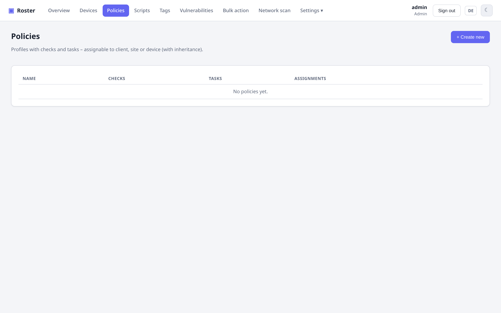

# Checks & tasks

Policies bundle **checks** (monitoring) and **tasks** (scheduled automation) and are
assigned to a company, site or device with inheritance (device → site → company).

{ .shadow }

## Checks

Each check has its own frequency, severity, output comparison and platform targeting:

- **Thresholds**: `disk`, `memory`, `cpu`, pending `updates`.
- **Script**: run a shell/PowerShell script and evaluate its result.
- **Network**: native `ping`, `tcp` port, `http` status.
- **Open ports**: alert when a device exposes a public port not on an allow-list.
- **Temperature**: warning/failing when a sensor gets too hot — by default at the limits
  the chip reports itself (critical at `crit`, warning at `max` or 10 °C below `crit`),
  optionally with your own °C thresholds and a sensor filter such as `cpu` or `nvme`.
- **Fans**: failing when a fan stops, its chip raises an alarm or it runs below a minimum
  speed (the chip's own or yours), optionally filtered to e.g. the CPU fan.
- **Proxmox backups**: every guest on a PVE host has a recent, successful backup and sits
  in a backup job — see [Proxmox VE](proxmox.md).

Failing checks surface as a health badge in the device list and drive **alerting** and
**self-healing**.

## Tasks

Scheduled scripts with a frequency (interval / daily / weekly / …), keeping the last run
per task plus a full run history. You can also **re-run** any check or task on demand with
the ↻ button.

!!! tip "Tasks or backups?"
    Tasks are scheduled by the agent and run on the device itself. Scheduled **backups**
    live in their own section of a policy — they are scheduled by the server and can wait
    for another device and trigger a follow-up action on one. See [Backups](backups.md).

## Self-healing

Automatic remediation: run a script or restart a service **when a check fails** — so common
problems fix themselves before anyone gets paged.

## Scripts

A reusable **script library** (shell / PowerShell, with platform targeting) powers script
checks, tasks, self-healing and ad-hoc "run script" actions.

!!! warning "Script checks/tasks are remote code"
    Anything that runs scripts on endpoints is powerful. Grant the `Scripts` and
    `Operate devices` permissions deliberately — see
    **[Roles & permissions](permissions.md)**.
