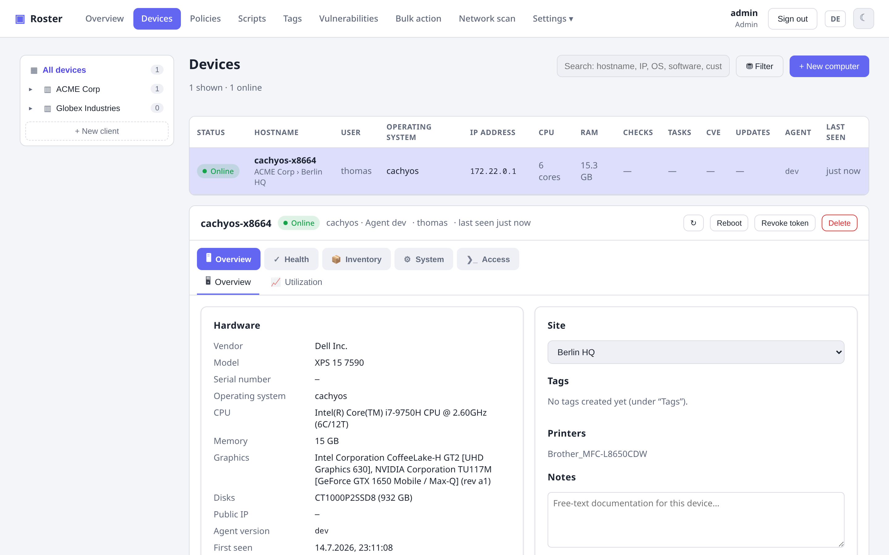
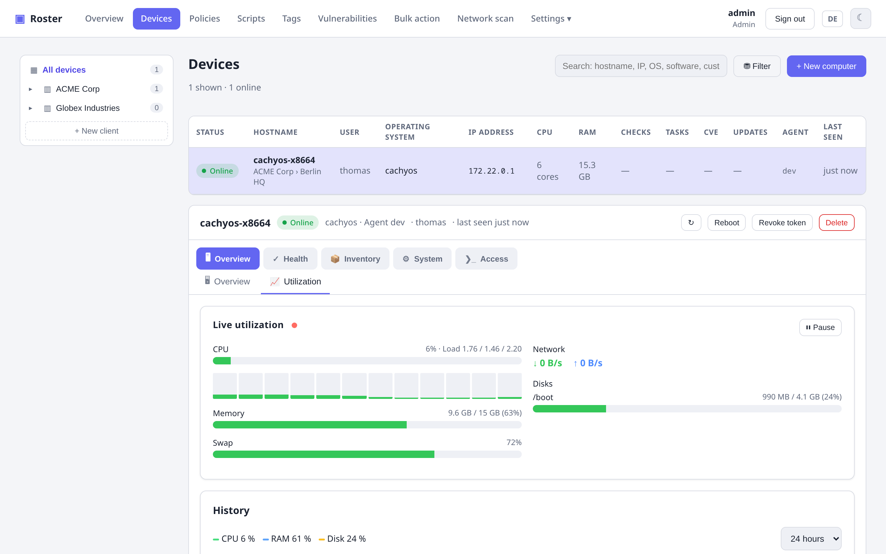

# Inventory

Every agent reports a full hardware/software inventory on each check-in — no manual
scanning required.

{ .shadow }

## What's collected

- **Hardware**: vendor, model, serial, CPU (model + cores), memory, disks.
- **Operating system**: name, version, logged-in users, uptime.
- **Network**: interfaces with IP and MAC addresses; public IP.
- **Software**: installed applications with versions; printers.
- **Listening/open ports**: the agent reports listening sockets (attack surface), with an
  external-reachability check and a ports-whitelist check type.

## Live utilization & history

On demand, pull a live snapshot of CPU (per core), RAM, disk and network — and browse
stored **time series** with 24 h / 7 d / 30 d charts.

{ .shadow }

## Cross-platform agents

Agents run as a service on **Windows, Linux and macOS** and **auto-update** from the
server. They use a pull model — only outbound connections, no inbound port on the client.

## Custom fields

Attach TRMM-style **custom fields** to a company, site or device, and populate them with
JSON collector tasks and Twig-like placeholders (e.g. `{{ agent.domains | first }}`).
