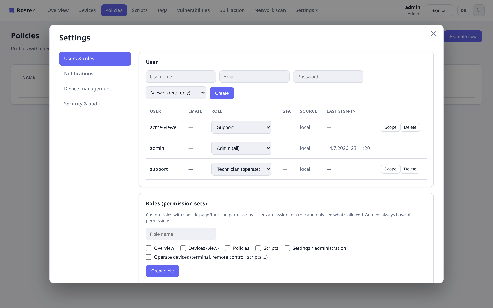
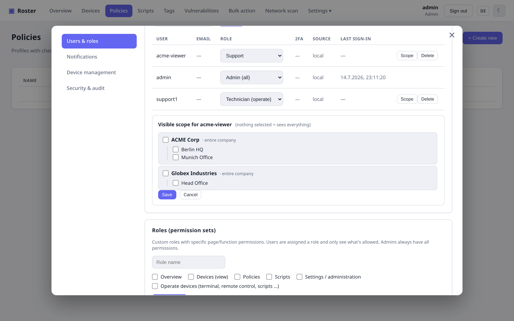

# Roles & permissions

Roster has a two-layer access-control model so you can give each user exactly what they
need — and nothing more:

1. **Permissions** — *which pages/functions* a user can use.
2. **Data scope** — *which companies/sites* a user can see.

Both are enforced **server-side**, not just hidden in the UI: a restricted user hitting an
API endpoint directly gets `403`.

## Built-in roles

Every user has one of three built-in roles:

| Role | Sees | Can operate devices | Manage |
| --- | --- | --- | --- |
| **Viewer** | Dashboard, Devices | — | — |
| **Technician** | Dashboard, Devices | ✔ | — |
| **Admin** | Everything | ✔ | ✔ (always full access) |

## Custom roles (permission sets)

For anything in between, create a **custom role** under **Settings → Users & roles** and
tick exactly the permissions it should grant:

- `Overview`, `Devices (view)`, `Policies`, `Scripts`, `Settings / administration`
- `Operate devices` (terminal, remote control, run scripts, reboot, …)

Assign the role to a user from the role dropdown. Example: an *Auditor* role with only
*Overview* + *Devices (view)* — read-only, no operating, no settings.

{ .shadow }

!!! note "Admin-only management stays admin-only"
    User, role and enrollment-token management is always restricted to real admins — a
    custom role can never grant the ability to create admins. You also cannot remove your
    own admin role or delete the last remaining admin.

## Per-user data scope

Independently of permissions, you can **limit a user to specific companies or sites**.
Click **Scope** on a user and tick the companies (whole company) and/or individual sites
they may see:

{ .shadow }

A scoped user then only sees the **devices, dashboard counts, search results and the
company tree** for their assigned companies/sites — everything else is hidden, and any
attempt to open a device outside their scope is blocked with `403`. Unassigned devices are
invisible to scoped users.

- **Nothing selected = sees everything** (the default, unchanged behavior).
- **Admins are never scoped** — they always see the whole fleet.

## How it fits together

```text
User ──> built-in role (viewer/technician/admin)
     └─> optional custom role  → effective page/function permissions
     └─> optional data scope    → visible companies/sites
```

Existing users are unrestricted by default, so turning this on changes nothing until you
explicitly assign a custom role or a scope.
