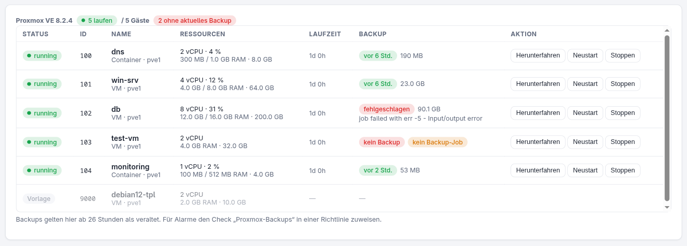
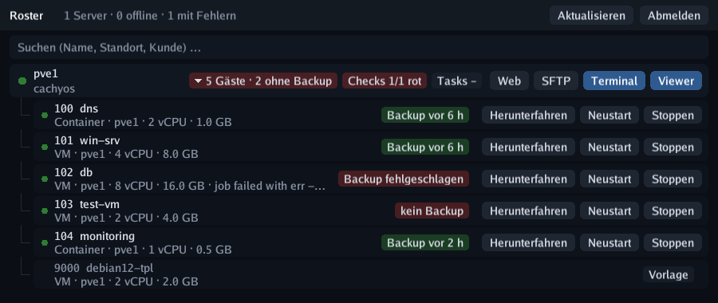

# Proxmox VE

Install the Roster agent on a **Proxmox VE host** and the device gets a **Proxmox** tab:
all VMs and containers of the cluster, their resources, **start / shut down / reboot /
stop**, and the **backup state** of every guest — plus a check type that turns red when
backups are missing, outdated or failed.

{ .shadow }

## How it works

The agent detects PVE by the presence of `pvesh`, the local API CLI of every node. It runs
as root, so **no API token is needed** and the Roster server never talks to the Proxmox API
directly — everything travels through the agent's normal check-in and command channel.
`pvesh` works cluster-wide: **one agent on one node is enough** for the whole cluster.

| What | Source |
| ---- | ------ |
| Guests (VMs + containers, status, CPU/RAM/disk, uptime) | `/cluster/resources?type=vm` — fresh on every check-in |
| Latest backup per guest (time, size, storage, count) | content of every storage with `backup` content (local, NFS, **PBS** …) |
| Result of the last backup run per guest | vzdump tasks; job runs are parsed from their task log (`Finished` / `failed - …`) |
| Guest not in any backup job | `/cluster/backup-info/not-backed-up` (PVE ≥ 7.1) |

The guest list is fetched on every check-in so the status is right straight after an
action. Backup information changes rarely and is cached for **10 minutes**; parsed task
logs never change and are remembered per task.

!!! note "Existing Proxmox API integration"
    The API-token integration under *Settings → Proxmox* (guest reboot as check
    remediation) keeps working independently. The agent-based view needs no configuration
    at all.

## Controlling guests

With the *Operate devices* permission, each guest has:

- **Start** (stopped guests)
- **Shut down** — clean shutdown via ACPI / container shutdown
- **Reboot** and **Stop** (hard power-off) — both ask for confirmation

The action runs as a PVE task on the host; the result and the new state arrive with the
check-in that immediately follows. Every action is written to the audit log.

## Backup check

Add the check type **Proxmox backups** to a policy and assign it to the PVE host:

| Option | Default | Meaning |
| ------ | ------- | ------- |
| max. age (h) | 26 | latest backup may be at most this old (daily job + buffer) |
| Only VMIDs | all | comma-separated list of guests to check |
| Exclude VMIDs | — | guests to skip |
| include stopped | on | powered-off guests need a current backup too |
| require backup job | on | failing when a guest is in no backup job |

Templates are never checked. The check fails if any selected guest has **no backup**, an
**outdated** one, a **failed last run**, or (optionally) **no backup job**, and lists the
offenders in its output (the agent reports in German), e.g.
`2 von 5 Gästen ohne aktuelles Backup: 102 db (letzter Lauf fehlgeschlagen: … Input/output error), 103 test-vm (kein Backup)`.
From there it feeds alerting, the device health badge and the red badge in the taskbar
app like any other check.

## In the taskbar app

Proxmox hosts get a **“5 guests”** pill in the taskbar app — red with the number of guests
without a current backup. Clicking it expands the guests underneath with backup badge and
Start / Shut down / Reboot / Stop buttons (Reboot and Stop need a second click to confirm).
Typing a VMID or guest name in the search box shows matching guests directly.

{ .shadow }
