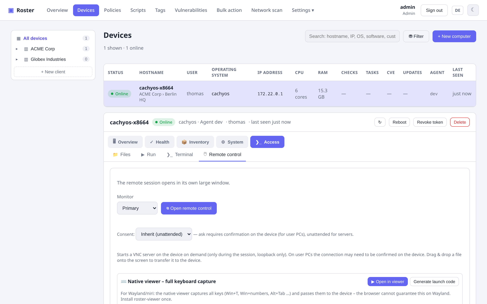

# Remote desktop & terminal

Roster has **built-in remote control and an interactive terminal** — no third-party VNC
software, no second daemon. Everything runs over the same **on-demand tunnel**: the agent
parks a lightweight long-poll, and a session is spun up only when you start one.

{ .shadow }

## Remote desktop

The agent *is* the VNC server (a built-in RFB server), so there is nothing extra to
install. Screen, mouse and keyboard are relayed through the tunnel. Features:

- **Login screen / UAC / lock screen** coverage on Windows (the capture helper follows the
  input desktop).
- **Clipboard sync**, **monitor selection**, **drag-&-drop file transfer** onto the remote
  desktop.
- **Live resolution switching** (RFB `DesktopSize`) — change the resolution without a black
  screen, plus a one-click **guest-driver installer** for VMs (Proxmox / VirtIO / SPICE)
  where the resolution is greyed out.

### Two ways to connect

=== "Browser (noVNC)"

    Click **Open remote control** and it runs right in your browser. On Windows/Chromium,
    fullscreen enables the Keyboard Lock API so system keys reach the device.

=== "Native viewer (recommended on Linux/Wayland)"

    A bundled `roster-viewer` (SDL3, **cgo-free**, downloads for Linux/Windows/macOS with
    no toolchain) captures **all** keys via `keyboard-shortcuts-inhibit` — including Win+T,
    Win+numbers and Alt+Tab that the browser cannot grab on Wayland. It has a floating
    AnyDesk-style toolbar with **real Ctrl+Alt+Del** (SendSAS), block-local-input,
    on-screen message and a quality selector. Launch it with one click via a `roster://`
    link, or paste the launch code into its connect dialog.

## Remote terminal

An interactive shell over an on-demand WebSocket, with a pop-out window. On Windows you can
run as SYSTEM or as the logged-in user.

## Consent (attended vs unattended)

Remote sessions can require **consent at the device** (a prompt the user must accept) or run
**unattended** — configurable per company/site/device, so user PCs can prompt while servers
connect unattended.

## Security

- The VNC server binds to `127.0.0.1` only and runs **only during a session** — never
  exposed on the LAN.
- Access is gated by the same RBAC as the rest of the app (`Operate devices` permission)
  and is audited.
