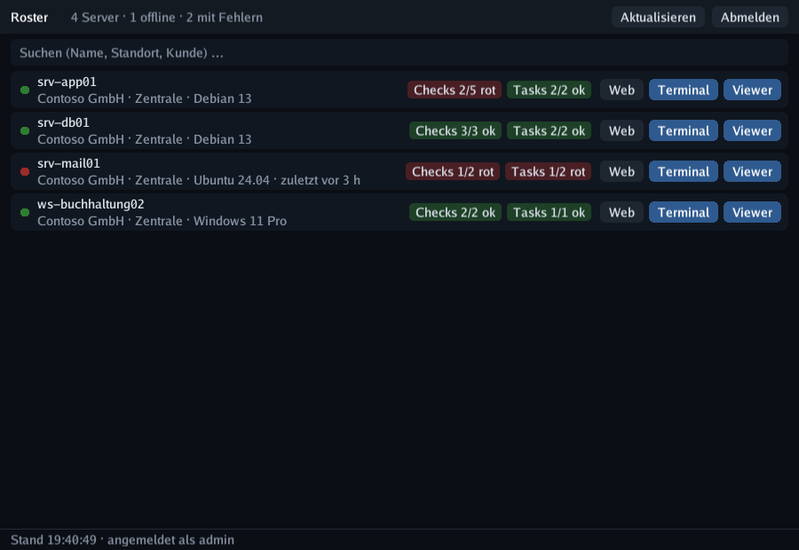

# Taskbar app

`roster-tray` puts your fleet one click away: a **system-tray icon** plus a compact window
that lists every server with its **check** and **task** result, and opens a **terminal** or
the **remote-control viewer** per row.

{ .shadow }

Like the viewer, it is a **cgo-free** Go binary that renders with SDL3 through purego —
no runtime to install, cross-builds for Linux/Windows/macOS without a toolchain.

## What it shows

- **Status dot** per device — online, offline, or unmanaged.
- **Checks** badge — green `Checks 4/4 ok`, red `Checks 1/4 rot` as soon as one fails.
- **Tasks** badge — same idea, based on the last run of every task.
- Company / site / OS, and how long an offline device has been quiet.
- **Temperature** badge — the hottest CPU in neutral grey; if any sensor is in its warning
  or critical range, that sensor instead, in amber or red (e.g. `NVMe 86 °C`). A red
  **fan** badge appears only when a fan stops, raises an alarm or runs too slow.
- The tray icon itself turns **red** when anything fails and **amber** when a device drops
  offline, with a summary in the tooltip — so a glance at the taskbar is enough.

Proxmox hosts can be expanded to show their VMs and containers with backup badge and
start/stop buttons — see [Proxmox VE](proxmox.md#in-the-taskbar-app).

Type anywhere to filter by name, site or company (and VMID / guest name); `F5` (or the tray menu) refreshes, and the
list polls on its own every 30 s (`refresh_sec`).

## Terminal and viewer buttons

| Button | What happens |
| ------ | ------------ |
| **Terminal** | Opens your normal terminal emulator (kitty, foot, alacritty, GNOME Terminal, Konsole, Windows Terminal …) running `roster-tray --term <device>`, which pipes stdin/stdout through the same on-demand terminal tunnel the web UI uses. You keep scrollback, copy & paste and colours — the app ships no terminal emulator of its own. |
| **Viewer** | Requests a remote-control session and launches the native `roster-viewer` with the ready-made launch code — the same path as the browser's *Open in viewer* button, but without the detour. |
| **SFTP** | Hands `sftp://user@host/` to your desktop's registered program (Nautilus/Dolphin mount it via GVFS/KIO), or falls back to the first installed client it finds — FileZilla, Dolphin, Nautilus, Nemo, Thunar, Krusader, Konqueror, gftp; WinSCP on Windows. |
| **Web** | Opens the device page in your browser (double-clicking the row does the same). |

!!! warning "SFTP goes straight to the device, not through the tunnel"
    Terminal and Viewer are relayed by the Roster server, so they reach a device behind NAT
    or a firewall. **SFTP does not**: it is a plain SSH connection from your workstation, so
    the device needs an SSH server and has to be reachable from where you sit. The button
    only appears when Roster knows an address for the device — the first real IPv4 from the
    inventory (loopback, link-local and `docker*`/`br-*`/`veth*`/`virbr*` interfaces are
    skipped), otherwise the hostname, otherwise the public IP. Devices found by the network
    scan get the button too, even without an agent.

    Set the login name with `sftp_user`; force a specific program with `sftp_command`, which
    takes the placeholders `{{host}}`, `{{user}}`, `{{url}}` and `{{name}}`:

    ```json
    { "sftp_user": "root", "sftp_command": "filezilla {{url}}" }
    ```

## Sign-in

You sign in once with username, password and (if enabled) the **two-factor code**. The app
then creates a **user API token** for itself and stores it in `tray.json` — the session
itself is dropped, so you are not thrown out after 12 hours. *Sign out* in the tray menu
revokes the token on the server.

```
~/.config/roster/tray.json        # Linux/BSD (0600)
~/Library/Application Support/…   # macOS
%AppData%\roster\tray.json        # Windows
```

| Key | Meaning |
| --- | ------- |
| `url`, `user`, `token` | Server and stored access (written at sign-in) |
| `insecure` | Skip TLS verification — only for self-signed test servers |
| `refresh_sec` | Poll interval for the device list (default 30) |
| `terminal` | Force a terminal emulator instead of auto-detection |
| `viewer_path` | Path to `roster-viewer` if it is not next to the binary or on `PATH` |
| `shell` | Default shell for the remote terminal (`shell`, `bash`, `cmd`, `powershell`) |
| `sftp_user` | Login name for the SFTP button (empty = none) |
| `sftp_command` | Program for the SFTP button instead of the desktop handler; placeholders `{{host}}` `{{user}}` `{{url}}` `{{name}}` |
| `ui_scale` | Fixed UI scale (0 / absent = auto-detect). `Ctrl` `+` / `Ctrl` `-` change it live and save it, `Ctrl` `0` returns to auto |

## Application launcher

`make install-tray` puts everything where the desktop expects it — no root, no packaging:

```bash
make install-tray                        # ~/.local (binary, .desktop, icon)
make install-tray-autostart              # additionally start into the tray at login
sudo make install-tray PREFIX=/usr/local # system-wide instead
make uninstall-tray                      # remove it again
```

It installs:

| File | Purpose |
| ---- | ------- |
| `$PREFIX/bin/roster-tray` | the binary (the `.desktop` gets this absolute path) |
| `$PREFIX/share/applications/de.boonkerz.roster.tray.desktop` | the launcher entry (`deploy/linux/`) |
| `$PREFIX/share/icons/hicolor/256x256/apps/de.boonkerz.roster.tray.png` | the icon, generated by `roster-tray --write-icon` |

The app sets its **application ID** (`de.boonkerz.roster.tray`) as the Wayland `app_id` /
X11 `WM_CLASS`, matching the `.desktop` file name and its `StartupWMClass`. That is what
makes the panel show the right name and icon for the window instead of a generic one.

Starting it a second time from the menu does **not** create a second tray icon: the new
process hands the request to the running one over a socket in `$XDG_RUNTIME_DIR`, which
then brings its window to the front.

If the entry does not show up right away, the desktop is still holding a cached menu —
`update-desktop-database ~/.local/share/applications` (the install target runs it) or a
re-login refreshes it. `~/.local/share/applications` must be covered by `XDG_DATA_DIRS`,
which is the default on every desktop.

## Running it

```bash
make tray                 # builds bin/roster-tray
bin/roster-tray           # window + tray icon
bin/roster-tray --hidden  # start into the tray only (autostart)
bin/roster-tray --selftest # check SDL3, window and tray support on this desktop
```

| Key | Action |
| --- | ------ |
| type anything | filter the list · `Esc` clears it, then hides to the tray |
| `F5` / `Ctrl` `R` | refresh now |
| `Ctrl` `+` / `Ctrl` `-` / `Ctrl` `0` | UI scale up / down / auto |
| `Ctrl` `Q` | quit |

Closing the window hides it into the tray; **Quit** in the tray menu ends the app. Without
tray support the window simply stays open, and closing it quits.

## HiDPI

The app draws into the full pixel buffer and scales fonts and spacing by the display
scale, so it stays sharp on 4K screens. On a Wayland session it asks SDL for the
**Wayland driver** on purpose: through XWayland the x11 driver reports *no* scale while the
compositor still hands out physical pixels — which is exactly how a 4K window ends up
looking 1.75× too small. Set `SDL_VIDEODRIVER` yourself to override that choice.

If the scale still cannot be detected (plain X11, no `Xft.dpi`), zoom with `Ctrl` `+` /
`Ctrl` `-` — the value is stored as `ui_scale` and reused on the next start; `Ctrl` `0`
switches back to auto-detection. `roster-tray --selftest` prints the video driver and every
scale value SDL reports, which usually explains the size in one line.

!!! note "Linux desktops"
    The tray icon uses SDL3's `SDL_Tray`, which talks to the StatusNotifier/AppIndicator
    service of your panel (waybar, GNOME with the AppIndicator extension, KDE, XFCE …).
    `--selftest` tells you in one line whether SDL3 on this machine brings tray support and
    whether the menu callbacks arrive.

For autostart on Linux, drop a `.desktop` file into `~/.config/autostart/`:

```ini
[Desktop Entry]
Type=Application
Name=Roster
Exec=/usr/local/bin/roster-tray --hidden
```
