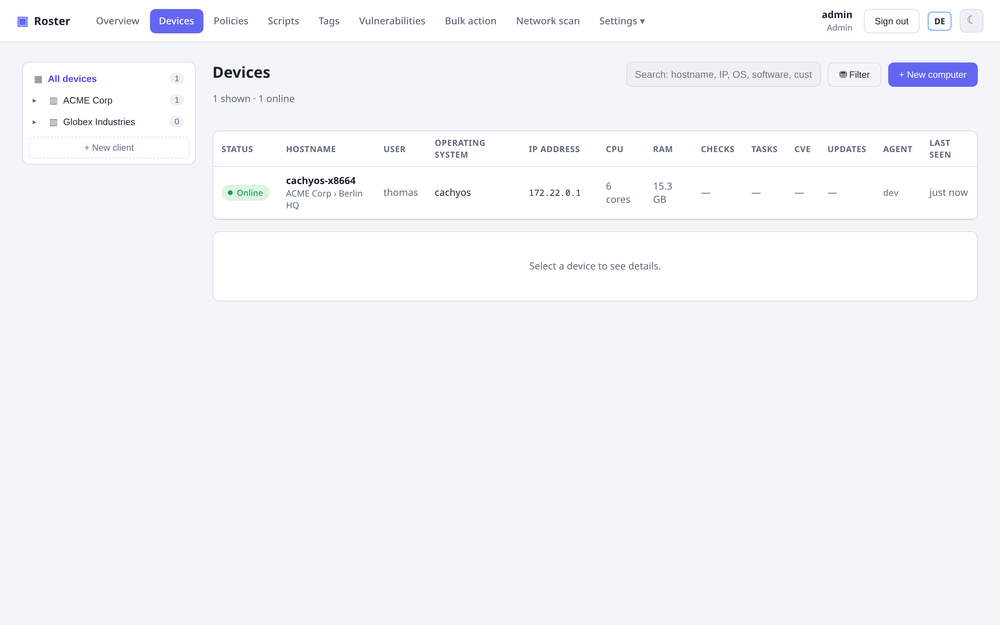

# Getting started

Roster is a single Go binary with the web UI and all agent binaries embedded. You need
**Go 1.26+** and **Node.js** only to build it; at runtime it is one self-contained
executable plus a database (SQLite by default).

## 1. Build

```bash
# Build the server (embeds the web UI + cross-compiled agents)
make server

# or manually:
cd web && npm install && npm run build && cd ..
make agents-embed
CGO_ENABLED=0 go build -ldflags "-s -w" -o bin/roster-server ./cmd/server
```

## 2. Run

```bash
./bin/roster-server run
```

On first start Roster creates an **admin** user and prints a generated password (unless
you set one via env). Open the UI, sign in, and you're on the dashboard.

!!! tip "Local testing vs production"
    For a quick local test you can run over plain HTTP. For production, terminate TLS at a
    reverse proxy (set `ROSTER_BEHIND_PROXY=true`, `ROSTER_SECURE_COOKIE=true`) or let
    Roster serve TLS directly — see **[Configuration](configuration.md)**.

## 3. Enroll your first agent

1. In the UI, click **+ New computer**.
2. Pick the target OS — Roster generates a one-line install command with the server URL
   and a fresh enrollment token baked in, and serves the matching agent binary.
3. Run it on the target machine. The agent installs itself as a service, enrolls, and
   starts reporting inventory within a minute.

{ .shadow }

Agents **auto-update**: when you deploy a newer server, agents pull the new binary on their
next check-in.

## 4. Organize your fleet

Roster uses a **Company → Site → Device** hierarchy (TacticalRMM-style):

- Create **companies** (clients) and **sites** under Settings.
- Bind an enrollment token to a site so devices land there automatically, or move a device
  to a site later from its detail page.

This hierarchy also powers **[per-user data scope](features/permissions.md)** — limiting a
user to specific companies/sites.

## Next

- Lock down who sees what with **[Roles & permissions](features/permissions.md)**.
- Set thresholds and automation with **[Checks & tasks](features/checks-tasks.md)**.
- Connect to a machine with **[Remote desktop & terminal](features/remote.md)**.
