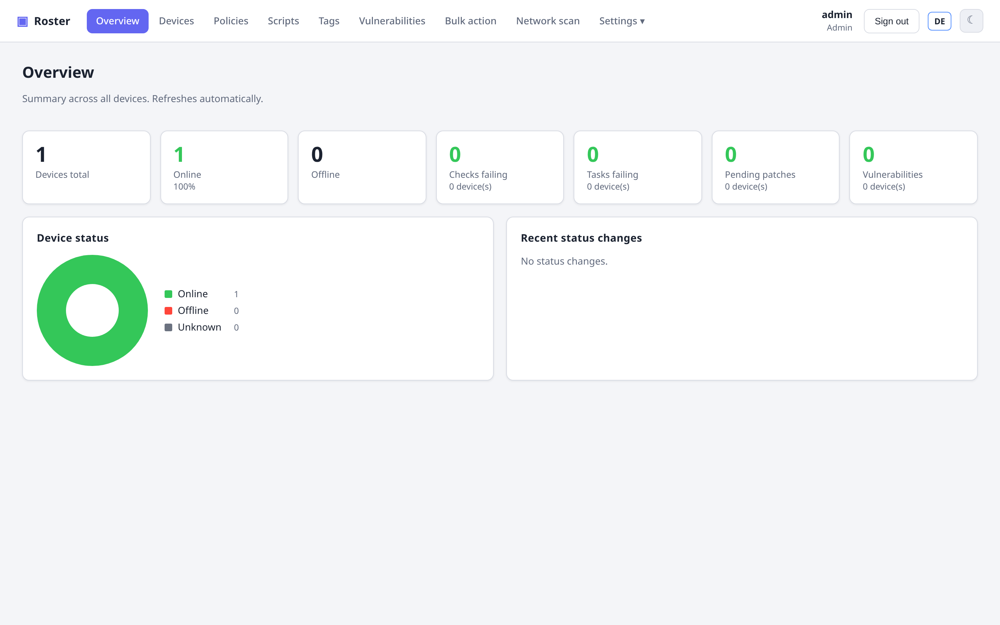

# Roster

**Self-hosted, TacticalRMM-style inventory & remote management** for computers and
servers. A single Go server — with the React web UI and all agent binaries embedded —
talks to a lightweight cross-platform Go agent. Everything ships as **one binary**; the
UI is fully **bilingual (English / German)**.

{ .shadow }

## Why Roster

- **One binary, self-hosted.** No external services, no second daemon. SQLite out of the
  box (PostgreSQL optional). Put it behind your reverse proxy and go.
- **Cross-platform agents** for Windows, Linux and macOS with **auto-update**.
- **Real remote control** built in — browser *or* a native viewer — plus an interactive
  terminal, over the same on-demand tunnel. No third-party VNC software.
- **Fine-grained access control**: custom roles (which pages/functions a user gets) and
  per-user data scope (limit users to specific companies/sites).
- **Everything an RMM needs**: checks & tasks, live utilization, patch management,
  software distribution, CVE scanning, network discovery, alerting.

## At a glance

- :material-monitor-dashboard: **[Inventory](features/inventory.md)** — hardware, OS,
  network, disks, software, printers.
- :material-check-network: **[Checks & tasks](features/checks-tasks.md)** — disk / CPU /
  memory / updates / script / ping / TCP / HTTP / open-ports, scheduled tasks.
- :material-remote-desktop: **[Remote desktop & terminal](features/remote.md)** — browser
  or native viewer, live resolution switch, real Ctrl+Alt+Del.
- :material-account-lock: **[Roles & permissions](features/permissions.md)** — custom
  roles + per-user company/site scope.
- :material-lan: **[Network & discovery](features/network.md)** — CIDR scan, SNMP printer
  info, adopt unmanaged hosts.
- :material-package-down: **[Patching & software](features/patching.md)** — scan, approve,
  install; deploy packages.

## Next steps

Head to **[Getting started](getting-started.md)** to build, run and enroll your first
agent in a couple of minutes.
